<picture>
  <source media="(prefers-color-scheme: dark)" srcset="./dark.svg">
  <source media="(prefers-color-scheme: light)" srcset="./light.svg">
  
</picture>

## Hi, I'm numansd

I'm a freelance software developer based in Mumbai. I build **web**, **mobile app** and **eCommerce** products, and I also handle the SEO and Google Ads side of the sites I deliver.

## Focus

- **Web:** React front ends with Node.js back ends and REST APIs
- **App:** cross-platform mobile apps with React Native and Firebase
- **eCommerce:** online stores and service platforms, with SEO and Google Ads support

## Experience

- **Software Developer (Freelance):** 1.5 years of development work across web and mobile projects
- **Teaching:** 2 years of experience teaching IT subjects.

## Education

Diploma + Bachelors

## Featured Projects

| Project | What it is |
| --- | --- |
| [Carbonfix](https://carbonfix.in/) | Sustainability platform built to help reduce carbon and support nature-related activities |
| [SD](https://play.google.com/store/apps/details?id=com.qkly) | Hyperlocal services app: providers post services for free and customers book what they need |
| [Fitivate](https://play.google.com/store/apps/details?id=com.fitivate.app) | Gym activity app with exercise streaks |
| [Physiopulse Rehab](https://physiopulserehab.com/) | Physiotherapist website, with ads and SEO work |
| [Antim Sanskar Service](https://antimsanskarservice.in/) | Website built from scratch, with SEO and Google Ads |
| [Shah Ambulance Service](https://shahambulanceservice.in/) | Website built from scratch, with SEO and Google Ads |
| [Jansahara Ambulance](https://jansaharaambulance.com/) | SEO and Google Ads |

## Engineering Stack

REST APIs are part of every project above.

## GitHub Activity

<picture>
  <source media="(prefers-color-scheme: dark)" srcset="https://github-readme-stats.vercel.app/api?username=NumaanSayyed&show_icons=true&theme=transparent&title_color=22D3EE&text_color=94A3B8&icon_color=7C3AED&hide_border=true">
  
</picture>

## Connect

- Portfolio: [numan-sd.vercel.app](https://numan-sd.vercel.app/)
- LinkedIn: [numan-sayyed](https://www.linkedin.com/in/numan-sayyed-28367420b/)
- Instagram: [@numansd_](https://www.instagram.com/numansd_)
- GitHub: [NumaanSayyed](https://github.com/NumaanSayyed)
